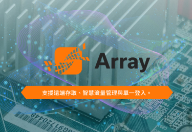
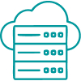

## Array

#### SSL VPN 解決方案

### 新常態下的遠端存取新標準：零信任架構的次世代 SSL VPN

採零信任架構，強化遠端存取安全，支援彈性部署與多平台使用，滿足新常態下遠端與行動辦公的高度安全需求。

- 多重認證

- 設備認證

- 僅可至預設限定資源進行存取

- 遵循預設各類政策

- 強大可擴充性

### 企業信賴的全方位 SSL VPN 解決方案

Array SSL VPN 提供多元平台支援、彈性存取方式與細緻的安全控管機制，無論是 BYOD 裝置管理、多因素身份驗證、細粒度存取政策，或是彈性部署於虛擬化與雲端環境，皆可滿足企業遠端辦公與行動工作需求，確保資料安全、存取順暢與管理便利。

###### 不受設備限制，無論是受控管設備或 BYOD

Windows、Mac、Chromebook、Linux、iOS、Android 等。 DesktopDirect 功能可確保安全的使用個人設備。

###### 設備身份認證和訪客安全檢查

對設備認證、獨特的硬體確認，以及訪客端安全策略執行預先身份驗證檢查。

###### 用戶身份認證、MFA 和單點登錄

可選擇 LDAP、SAML、OIDC 或雲端的多因子身份驗證、IDaaS 和單點登錄。

###### 靈活的 SSL VPN 存取方法

從單一、簡化的以 Web 為基礎進行網路層存取、RDP、客戶端伺服器和應用層存取。

###### 資源特定的存取政策

為基於身份的 URL、應用程式、文件和網路存取制定個別用戶策略，並提供大量日誌和統計訊息。

###### 可訂制的虛擬入口

多達 256 個入口，可根據各類群體的安全性和可用性偏好量身訂做。

###### 在業務連續性要求下，許可證需求爆發性成長

緊急用戶許可證的數量完全可滿足您的需求，其成本僅占標準遠端存取用戶許可證的一小部分。

###### 實體、虛擬和雲端部署

可用作實體或虛擬設備，或作為 AWS 和 Google Cloud Platform 上的雲端原生實例。

### 關鍵應用的第一道防線：高效 Web 應用防火牆

防禦零時差攻擊與應用層漏洞，WAF 提供即時、智慧型的高階保護機制，強化關鍵系統防禦力。

- 自動阻擋零時差攻擊

- 主動阻擋 DDoS 攻擊

- 防止攻擊用戶

- 精準防護殭屍攻擊

- 對於網頁及行動裝置 API 均提供全面性防護

### 全面進化的 Web 應用防禦解決方案

Array WAF 結合主動式防禦機制與智慧分析能力，提供對抗 DDoS、Zero-Day 攻擊、機器人濫用與 API 威脅的強大保護。支援細緻權限控管、安全交易驗證與雲端彈性部署，協助企業有效抵禦多元攻擊手法，守護應用服務穩定與資料安全。

###### 主動 DDOS 防禦

經過行為分析進行剖析，可提高應用安全性並預測攻擊將如何展開。

###### 自動阻止 ZERO-DAY 攻擊

基於機器學習運算法的多種技術結合起來，可標記任何異常並自動阻止威脅。

###### 針對性保護

內建安全掃描器可檢測應用來源碼中的漏洞並阻止攻擊企圖。

###### 防止對最終用戶的攻擊

由於客戶端安全模組數據屏蔽和精細存取設置，應用程式用戶可以保持安全。

###### 防止機器人攻擊的精確保護

為用戶建立行為模式可以輕鬆識別機器人並阻止自動攻擊，而不會減慢合法流量。

###### 網路和行動 API 的完全安全

經過分析 JSON 和 XML 數據以及協力廠商整合來阻止對 Web 和行動 API 的威脅。

###### 在業務連續性要求下，許可證需求爆發性成長

與 Array 負載平衡一起部署以建立端點到端點的應用交付網路解決方案。

###### 實體、虛擬和雲端部署

提供實體機或虛擬版本，亦提供在 AWS、Azure 和 Google Cloud Platform 上運作的雲端原生實例。