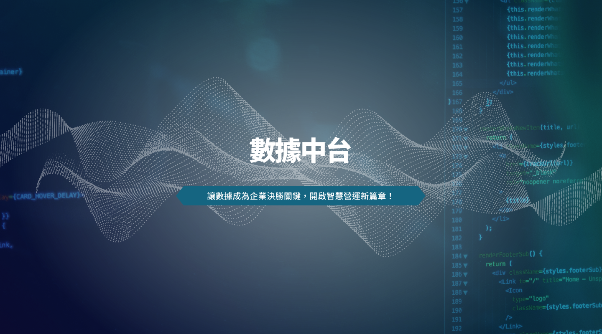

### 什麼是數據中台？

數據中台是企業數位轉型的核心引擎，透過統一整合企業內外部的各類數據資源，打破資料孤島，消除資訊斷層，為企業提供即時、可靠且高價值的數據基礎。數據中台不僅彙聚了業務、行銷、運營、財務等多元數據，更能靈活支援各部門數據應用，加速決策效率，推動業務創新。

### 數據中台的效益

- 數據整合與治理：自動連結各類數據源，高效清洗、標準化及管理數據，讓資料更純淨、更可靠。
- 即時洞察分析：結合先進分析引擎，快速生成可視化報表，幫助管理層與業務團隊及時掌握市場動態與客戶需求。
- 彈性服務調用：資料服務即插即用，各部門可依需求靈活獲取所需數據，提升作業效率。
- 數據賦能業務：促進行銷精準投放、客戶關係管理、供應鏈優化等多面向應用，全面提升企業核心競爭力。
- 安全合規無憂：嚴格遵循國際數據安全規範，確保資料安全與合規，讓企業無後顧之憂。

### 為什麼選擇我們的數據中台？

- 業界領先技術團隊，全方位支援企業數據建設。
- 專業客戶成功團隊，協助企業持續創造數據價值。

### 立即行動，搶佔智慧製造先機！

現在就是數據驅動企業成長的最佳時機！讓我們陪伴您的企業，一起打造高效、智能、敏捷的數據中台，開啟數位轉型新篇章。

聯繫電話：0912083643  張先生

E-mail：Simon.chang@ewill.com.tw