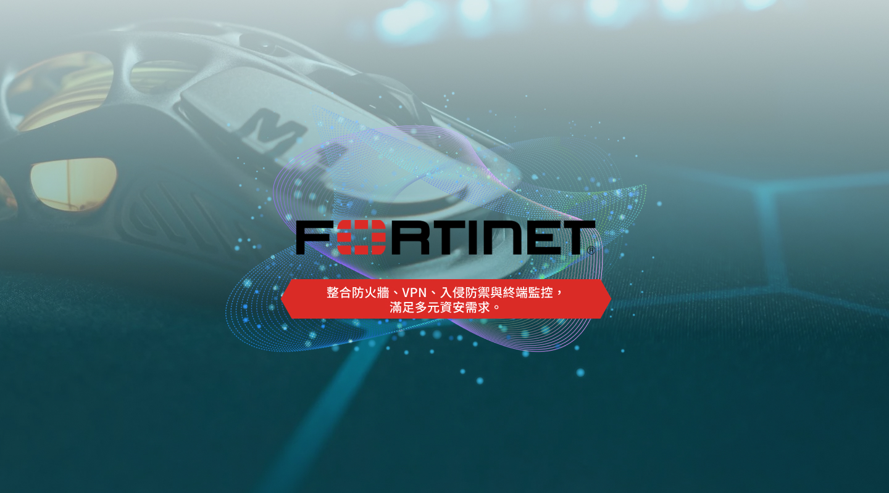
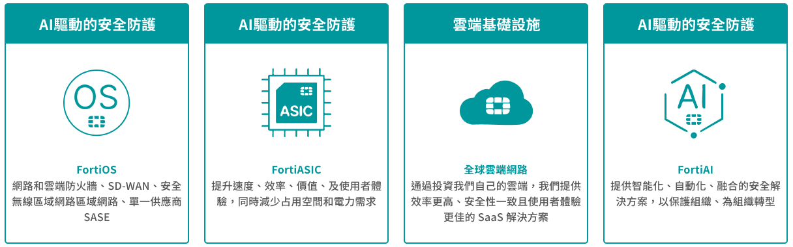
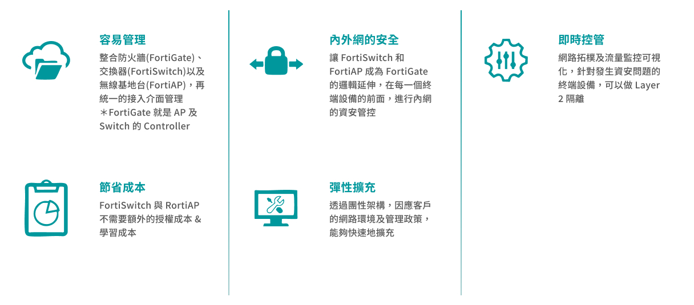

## Fortinet

#### 整合資安平台

### 透過創新提供無與倫比的安全性與效能

Fortinet 透過自主研發的作業系統、專屬 ASIC 晶片、全球雲端基礎設施與 AI 驅動防禦技術，提供從網路、邊界到應用層的全方位安全防護。這些創新架構不僅強化效能，更實現高度整合、智能化與自動化的資安防線，滿足企業對現代化防禦的所有需求。

### 一站式整合管理，打造高效安全的網路架構

透過 Fortinet 解決方案整合防火牆、交換器與無線設備，實現統一管理與可視化控管。提升內外網安全、節省成本、彈性擴充，同時掌握異常流量進行即時隔離，打造最符合企業需求的智慧網路環境。

### FortiOS－打造統一安全架構的核心基石

FortiOS 是 Fortinet 安全織網（Security Fabric）的核心作業系統，結合高效能與廣度涵蓋，支援從內部部署到雲端、混合、IT / OT / IoT 各類環境。
 透過統一的安全政策與集中管理介面，FortiOS 能夠整合網路與安全功能，提升可視性、簡化管理流程，有效消除潛在風險，確保一致且全面的防護體驗。

