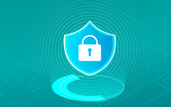
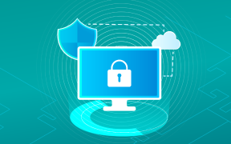

##### About Us

## 關於我們

鎰威科技專注於推動企業數位轉型，結合資訊安全、AI 科技與大數據應用。從架構規劃到服務導入，提供專業高效的一站式安全服務。秉持專業、效率、信任、創新的精神與持續提供優質服務的態度，攜手客戶共同邁向成長與成功。

##### What We Offer

## 服務項目

服務項目包含「軟體開發服務」、「資訊安全服務」和「系統規劃服務」，我們以 SSDLC 和 V-model 流程開發安全可靠的應用系統，透過 SecurityScorecard、IST、Acunetix 等工具加強資安防護，並以 Ubuntu、VMware 和 Proxmox VE 提供穩定、高效的系統規劃方案，全方位滿足企業數位轉型需求。

#### 軟體開發服務

結合 SSDLC 和 V-model 流程，從需求到部署貫穿安全測試，確保系統高穩定性和可靠性，實現高效、安全的數位轉型。

[了解更多](/services/#software_development)

#### 資訊安全服務

透過多項資安工具進行評級檢測、弱點掃描和日誌管理，提供端點安全、網路防護，確保企業系統穩定與數據安全。

[了解更多](/services/#security_services)

#### 系統規劃服務

提供 Ubuntu、VMware 和 Proxmox VE 三大虛擬化方案，具備靈活性、安全性與高效資源管理，滿足企業多樣需求。

[了解更多](/services/#system_planning)

##### Solutions

## 產品解決方案

鎰威科技提供五大解決方案，全面強化企業營運與資安防護。「智慧管理」導入 3D 儀表板、承攬商與環境監控系統，提升管理效率與即時應變能力。「資安評估」透過持續監控掌握風險，「資安檢測」運用滲透測試與弱點掃描找出漏洞，「資安防護」整合防火牆、端點防禦等技術建構防線，「資安強化」則針對系統與設備進行加固，打造可持續的資安韌性與防護體系。

#### 智慧管理

提供 3D 數位戰情儀表板、承商管理系統及環境監測系統，實現數據集中、視覺化管理，提升管理效率與安全性。

[了解更多](/solutions/#smart_management)

#### 資安評估

全面盤點企業資訊環境，找出潛在風險與漏洞，掌握現有防護狀況，量化資安成熟度，作為後續強化與改善的依據，建立穩固的資安管理基礎。

[了解更多](/solutions/#security_assessment)

#### 資安檢測

模擬真實攻擊情境，針對系統與應用進行滲透測試與弱點掃描，揭露防線弱點，協助企業主動修補風險、降低駭侵風險。

[了解更多](/solutions/#security_testing)

#### 資安防護

導入先進防禦技術，整合端點防護、行為分析、威脅偵測與即時防禦機制，強化資安韌性，快速攔截各類攻擊行為，確保營運持續穩定。

[了解更多](/solutions/#security_defense)

#### 資安強化

依評估與檢測結果，制定資安強化計畫，推動弱點修補、教育訓練與自動化防護，強化防禦深度，確保合規與營運安全。

[了解更多](/solutions/#security_enhancement)

