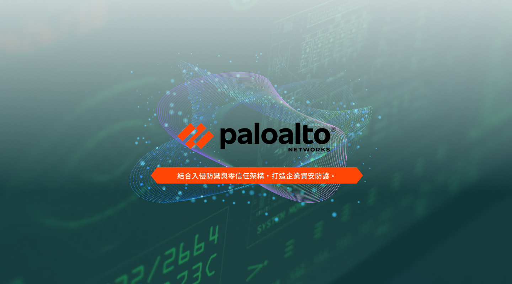
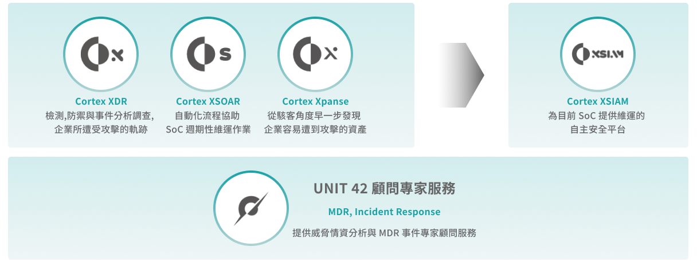
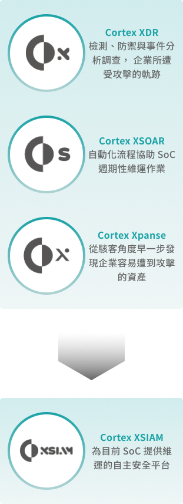

## Palo Alto

#### 次世代防火牆

### 雲端網路與資安整合方案

整合 ZTNA 2.0 與 SD-WAN，提供遠端與分支據點高速、安全的網路存取。
透過 ZTNA 2.0 動態控管用戶與裝置權限，取代傳統 VPN；結合 NG-CASB、SWG、FWaaS，全面保護 SaaS 應用與網路流量。
支援全雲端部署，適用於遠端工作、雲端應用與企業分點，打造統一且高效的零信任資安架構。

### Cortex 家族，從端點到自動化協助平台，提供一站式的服務

Cortex 家族串聯 XDR、XSOAR、Xpanse 到 XSIAM，從威脅偵測、事件調度、外部資產暴露管理到自動化安全營運，提供完整的一站式資安解決方案。
結合 UNIT 42 顧問專家支援，讓企業能快速應對威脅、優化 SOC 效能，全面提升資安防禦力。

### Prisma Cloud 雲端原生安全平台

Palo Alto 提供涵蓋公有雲、私有雲及混合雲環境的工作負載防護解決方案。
依企業需求，分為私有雲版（CWPP）與雲端版（CSPM＋CWPP），支援多雲平台安全、一致性防護與合規需求，協助企業打造零信任的雲端安全架構。

