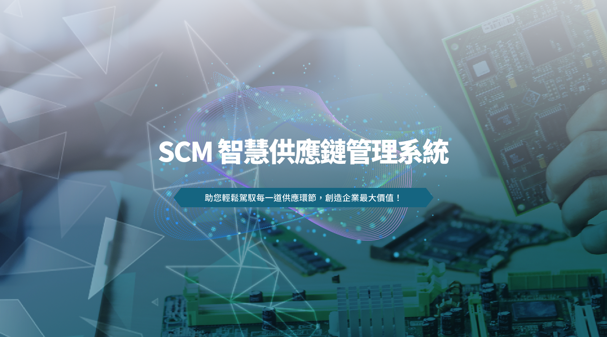

### 什麼是 SCM 系統？

SCM（Supply Chain Management，供應鏈管理）系統是一套整合企業上下游資源、提升協作效率的關鍵工具。

它協助企業全面掌握供應、製造、倉儲、物流及銷售等流程，實現資訊即時流通、成本最小化與利潤最大化。

### SCM 系統的核心優勢

- 提高運營效率， SCM 系統自動化並優化供應鏈各個環節，減少人工操作和重複性工作，有效縮短生產與交貨周期，提升整體運營效率。
- 降低成本，透過精準的需求預測、庫存管理和運輸規劃， SCM 系統幫助企業減少庫存積壓、避免過度採購，從而大幅降低倉儲和物流成本。
- 加強資訊透明度， SCM 系統將供應鏈各環節的數據集中管理，實現即時資訊共享，讓企業能夠及時掌握供應、庫存、訂單及交貨狀況，提高決策的準確性與反應速度。
- 提升客戶滿意度，透過精確的訂單管理與配送協調， SCM 系統能夠確保產品按時、按量交付，減少延誤與錯誤，增強客戶信任與滿意度。

### 為什麼選擇我們的 SCM 系統？

供應鏈協同與即時掌握全局狀態的需求愈加迫切－特別是在多品項、小批量、訂單波動大的情況下，生產計畫、庫存健康度、交付準時率往往受到挑戰。

我們觀察到，企業常見的幾個供應鏈痛點包括：

我們的供應鏈方案，能協助企業快速實現：

- 端到端視覺化：從接單到交付全鏈路追蹤
- 統一數據口徑：跨工廠、跨部門即時協同
- 全流程預警機制：即時發現缺料、積壓、交付延遲等異常
- 降本增效：優化庫存結構、減少資金佔用、提升交付可靠度
- 縮短協調與決策週期
- 降低人工整合與比對數據的錯誤率
- 建立數據驅動的管理文化
資訊整合共享，團隊協作無障礙
- 降低成本、減少資源浪費
- 快速應對市場與供應變化
- 客戶滿意度顯著提升

### 立即行動，搶佔智慧製造先機！

現在就聯繫我們，由專業顧問為您規劃專屬 SCM 解決方案，助您的企業實現智慧生產、效率翻倍、營運升級！

掌握數位時代脈動，讓 SCM 系統成為您邁向智慧製造的最佳夥伴。

聯繫電話：0912083643  張先生

E-mail：Simon.chang@ewill.com.tw