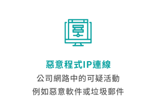
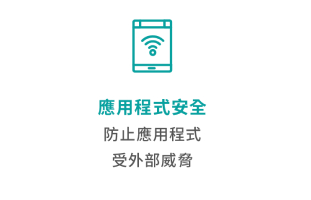
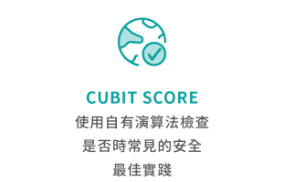
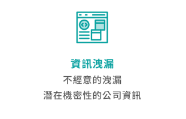
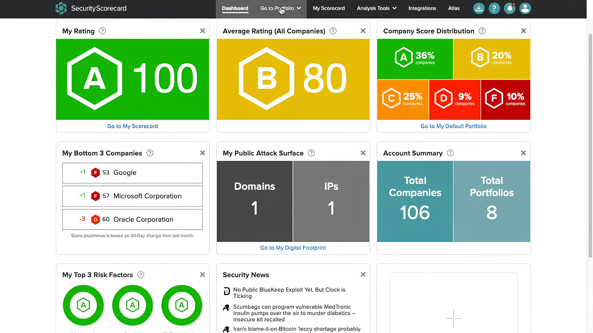

## SecurityScorecard

#### 資安評級工具

### SecurityScorecard 評級針對十組風險因素

可為企業本身與第三方供應商的網路資安風險管理帶來幫助的 SecurityScorecard，採用非入侵式資訊收集分析技術，在資料蒐集方面，包含公開資料收集、網路誘捕機制，以及威脅情資整合，加上弱點搜尋引擎，將可分析各個企業的10大風險類別。

### 一致的、數據驅動的安全評級標準

- 透過無與倫比的圖形全面了解網路風險，讓您全面了解生態系統風險。
- 找出每個供應商內的相關風險和特定漏洞，以便您可以與第三方合作加速風險緩解。
- 透過單一儀表板來簡化緩解措施並快速識別威脅暴露，突顯所有供應商的優點和缺點領域。

### 安全評級可以為您做什麼

客製化修復計劃

透過自動化和客製化的修復計劃來改善您的安全狀況，以達成目標安全記分卡評級，當您修復 IT 基礎架構中的關鍵漏洞時，您的評級將隨之提升。

### Forrester New Wave™：網路安全風險評級

SecurityScorecard 在2021 年第一季度報告中被評為網路安全風險評級領域的領導者。

SecurityScorecard 在以下評估標準中獲得的最高評分

- 資料準確
- 流程透明度
- 爭議解決
- 系統整合性
- 使用案例的廣度
- 商業策略