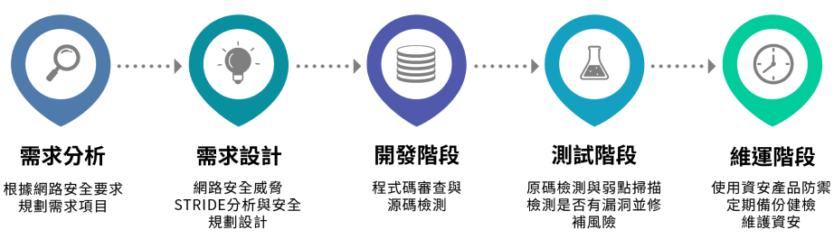
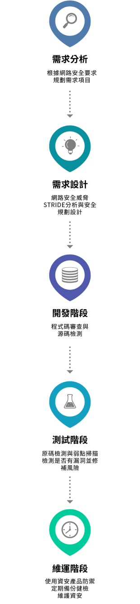
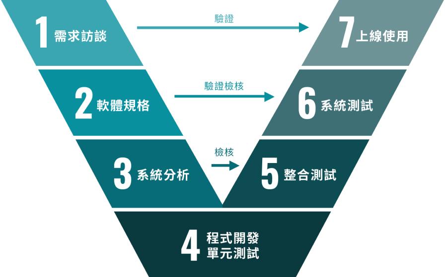
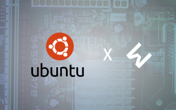
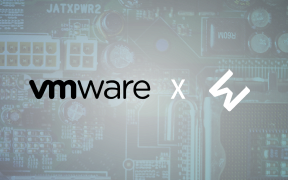
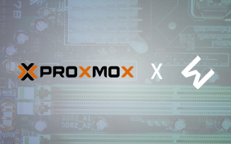

# 服務項目 - 鎰威科技有限公司

##### Software Development

## 軟體開發服務

軟體開發服務涵蓋「SSDLC安全應用系統開發周期」與「V-model」兩大開發流程，確保系統安全性與高品質。SSDLC強調安全測試貫穿開發各階段，而V-model則在每個開發階段後進行測試驗證，雙重保證系統的穩定性、可靠性與安全性，協助客戶實現高效且安全的數位轉型。

##### SSDLC

### SSDLC安全應用系統開發周期

SSDLC安全應用系統開發周期旨在通過安全設計的原則提升應用開發的穩定性和安全性。此周期涵蓋需求分析、設計、開發、測試及部署階段，確保在每個環節中加入安全性考量。透過SSDLC流程，開發團隊能有效識別和管理潛在風險，最終提供更安全且可靠的應用系統。

##### V-Model

### V模型

V-model開發模型是一種軟體開發流程，強調在每個開發階段後立即進行測試。從需求訪談、規格制定到系統分析和程式開發，逐步進行驗證與測試，確保品質。各階段的測試驗證結果可回饋至上一階段，提升系統的穩定性與可靠性，最終確保上線使用的高品質。

##### Security Services

## 資訊安全服務

資訊安全服務項目涵蓋「資安評估」、「資安檢測」、「資安評防禦」和「資安強化」四大服務 。透過 SecurityScorecard 進行資安檢測，協助企業全面了解安全狀況，並使用 IST、Acunetix、Graylog、Bitdefender 及 vicarius vRX 等工具提升資安等級，確保系統安全、穩定，提供企業可靠的資安服務。

### 服務項目

無縫接軌的專業資安策略，整合技術 & 服務  提供最佳防護。

##### System Planning

## 系統規劃服務

我們的系統規劃服務包含 Ubuntu、VMware 和 Proxmox VE 三大方案，提供靈活、穩定及高效的虛擬化解決方案。Ubuntu 提供高度的可定制性與安全性，VMware 則具備強大的虛擬化管理與高可用性功能，而 Proxmox VE 以開源平台為基礎，實現資源高效利用與成本控制，滿足不同企業需求。

#### Ubuntu

Ubuntu 是一個開源系統，擁有強大社群支持和高度安全性，具備靈活性和穩定性，可依需求定制，適應多變的專案需求，提供高效資源管理和卓越性能。

#### VMWare

VMware 提供強大虛擬化技術，高效利用硬體資源，具備高可用性和容錯機制，保障系統穩定。透過集中管理工具和優異的安全功能，提供靈活高效的系統服務。

#### Proxmox VE

Proxmox VE 提供高性價比的開源虛擬化解決方案，支持 KVM 和 LXC 技術，具備高性價比的開源解決方案，提供集中化管理工具與多種存儲選項，滿足不同業務需求。
