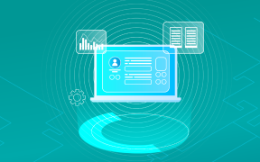
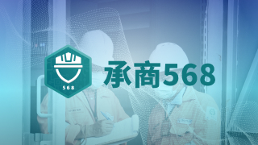
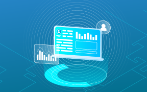

##### Smart Manufacturing

## 智慧製造

透過智慧製造整合方案，我們提供先進規劃與排程（APS）、製造執行系統（MES）、智慧供應鏈管理（SCM）及智慧倉儲管理（WMS）。

APS 以演算法實現資源最佳化與精準交期控管，MES 串接 ERP 與產線設備，強化全程品質追溯與效率提升，SCM 則整合上下游資源，打造端到端可視化供應鏈，降低成本並提升交付可靠度，WMS 自動化倉儲作業，搭配 AGV 與智慧料架，實現精準庫存與快速配送。透過數據整合、即時監控與可視化管理，協助企業全面提升生產效率、供應彈性與營運競爭力

#### APS 智慧生產核心

即時分析產線狀況，自動排程優化人力與設備資源配置。快速應對訂單變更與設備異常，確保生產流程順暢，全面提升產能利用率與交期可靠度。

了解更多

#### MES 製造執行系統

串接 ERP 與現場設備，實現資訊流與物流的整合。即時監控產線運作，快速掌握生產動態，強化品質追溯，有效降低錯誤率並提升生產透明度。

了解更多

#### SCM 智慧供應鏈管理系統

整合上下游資源，強化跨部門協作。透過精準需求預測與即時預警機制，降低庫存積壓與物流成本，確保交付準時率並提升客戶滿意度。

了解更多

#### WMS 智慧倉儲管理系統

即時掌握庫存流動，實現收貨、分揀與出庫等全流程自動化。支援 AGV 與智慧料架整合，提升作業效率與出貨準確性。

了解更多

##### Smart Management

## 智慧管理

透過智慧管理系統，我們提供承商管理系統與環境監測系統，協助企業實現數據集中化與視覺化管理，提升跨單位溝通效率與即時事件追蹤能力。結合多因子認證、數據整合與動態分析，確保在安全管理、環境監測及營運效率上達到最佳效能，推動企業智慧化與永續發展。

#### 承商管理系統

數位化管理承攬廠商及工地人員，實現多因子認證進場和快速身份核查，防止非法入場，並利用視覺化數據分析，提升管理效率與決策精確性。

了解更多

#### 環境監測系統

整合環境監測數據和 CCTV，提供即時數據更新與視覺化展示，提升數據管理效率及應急處理能力，實現集中管理，全面掌控環境狀況。

即將上線

##### AI Application Services

## AI 應用服務

我們的 AI 解決方案結合 AI Agent 智能代理人與 AI 數據分析與預測，協助企業全面提升營運效能。AI Agent 透過自然語言處理與機器學習，能自動化流程、即時回覆客戶需求並生成報告，讓人力專注於高價值任務，AI 數據分析與預測則能快速整合多元資料來源，運用深度學習模型進行精準預測，並以視覺化報表提供動態決策支持。
透過自動化、即時互動、數據驅動決策與嚴格的安全合規保障，我們為企業打造量身訂製的智慧架構，實現效率提升、風險控管與市場先機，助您邁向數位轉型的智能未來。

#### AI Agent 解決方案

自動化工作，全天候回應需求，提升服務效率。結合自然語言處理與機器學習，生成分析報告，協助企業專注高價值任務，加速數位轉型。

了解更多

#### AI 數據分析與預測

整合多元數據，透過機器學習進行精準預測。以視覺化報表動態掌握商機與風險，同時嚴格保障數據安全，打造企業專屬競爭力。

了解更多

##### Data Applications

## 數據應用

透過數據中台，統一整合企業內外部多元數據，打破資料孤島，提供即時且可靠的數據基礎，支援跨部門靈活應用與高效決策。結合 3D 數位戰情儀表板，以視覺化方式集中管理數據，即時共享資訊、簡化操作流程，提升跨單位溝通效率，降低管理成本並加速決策。

兩者協同運作，讓企業不僅能快速掌握市場動態狀況，更能強化策略規劃與執行效能，全面推動智慧營運與創新成長。

#### 數據中台

整合企業內外部數據資源，打破資料孤島，提供即時可視化洞察。加速決策與創新，同時嚴格保障數據安全，全面提升核心競爭力。

了解更多

#### 3D數位戰情儀表板

統一數據集中管理，提升跨單位溝通效率。3D視覺化平台即時共享信息、簡化操作流程，降低管理成本，提高決策效率。

即將上線