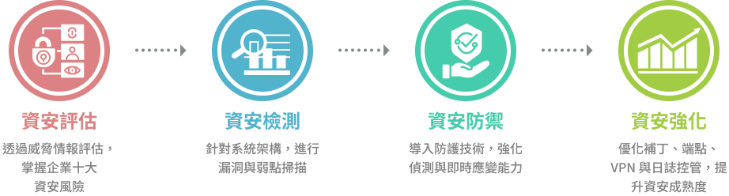
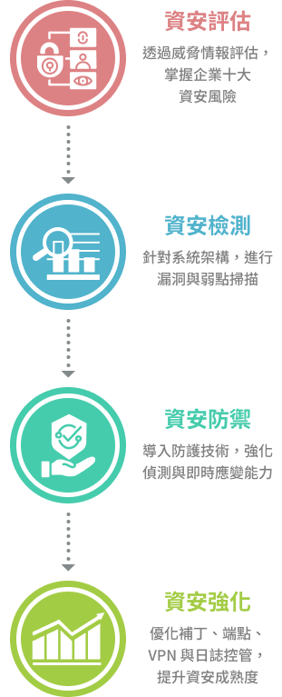
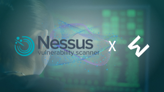
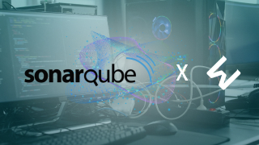
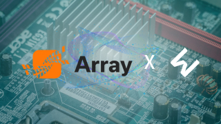

##### Security Services

資訊安全服務項目涵蓋「資安評估」、「資安檢測」、「資安評防禦」和「資安強化」四大服務 。透過 SecurityScorecard 進行資安檢測，協助企業全面了解安全狀況，並使用 IST、Acunetix、Graylog、Bitdefender 及 vicarius vRX 等工具提升資安等級，確保系統安全、穩定，提供企業可靠的資安服務。

無縫接軌的專業資安策略，整合技術 & 服務   提供最佳防護。

### 資安評估

針對企業資訊環境進行全盤盤點，發掘潛在風險與漏洞，協助企業了解現有防護現況，量化資安成熟度，作為後續改善與防護強化的重要依據，建立有效的資安管理基礎。

#### SecurityScorecard

SecurityScorecard 以非侵入方式持續監控企業資安狀態，覆蓋十大風險類別，提供清晰的資安評級，幫助企業提升網路與應用層安全。

了解更多

### 資安檢測

模擬真實攻擊情境，針對系統、網頁、應用程式與內部環境進行滲透測試與弱點掃描，揭露資安防線的薄弱處，協助企業主動修補風險、降低駭客入侵機會。

#### Tenable Nessus

Tenable Nessus 為領先業界的弱點掃描工具，能偵測逾 75,000 種漏洞，支援合規檢查、修補建議與報表整合，廣泛應用於企業風險管理。

了解更多

#### SonarQube

SonarQube 為原始碼靜態分析平台，支援多種語言，自動檢查程式碼安全性、品質與可維護性，整合 DevOps 流程強化開發資安。

了解更多

#### Acunetix

Acunetix 是一款專業網站安全掃描工具，可快速檢測 SQL 注入、XSS 等漏洞，符合 OWASP 標準，有效保障網站應用安全。

了解更多

### 資安防禦

導入先進防禦技術，包含端點防護、行為分析、威脅偵測與即時防禦機制，提升企業整體資安韌性，快速阻擋網路威脅與異常行為，確保營運不中斷。

#### Palo Alto

Palo Alto 為次世代防火牆領導品牌，整合入侵防禦、應用識別、沙箱與雲端情資，打造企業端對端的進階防護與整體資安架構。

了解更多

#### Fortinet

Fortinet 為整合式資安平台，提供防火牆、VPN、入侵防禦、網頁過濾與終端監控，兼具高效能與易部署，廣泛應用於企業與政府機構。

了解更多

#### Deep instinct

Deep Instinct 採用深度學習技術的端點防護平台，能在惡意程式執行前預測偵測並防禦，有效提升勒索病毒與未知威脅的防禦準確度。

了解更多

#### Bitdefender

Bitdefender 提供全方位資安防護，涵蓋防毒、EDR、加密等功能，適用於多平台環境，強力防範惡意攻擊，確保系統和資料的高度安全性。

了解更多

### 資安強化

依據評估與檢測成果，量身打造資安強化計畫，持續推動弱點修補、資安教育訓練、制度建置與自動化防護機制，提升防禦深度，確保長期合規與營運安全。

#### IST

IST 端點安全系統提供精確的內部行為管理與監控，防範資訊外洩與未授權存取，透過多層防護提升企業 IT 資產安全，保障機密資料不受威脅。

了解更多

#### Array

Array 提供高效能 SSL VPN、應用交付與流量管理方案，支援身分驗證、單一登入與加密傳輸，廣泛應用於企業遠端存取與分點連線。

了解更多

#### LOGSEC

LOGSEC 集中管理企業日誌，整合收集、分析與監控，強化資安事件掌控，提升企業日誌管理效率與資安透明度。

了解更多

#### Vicarius vRX

Vicarius vRX 為零代理式漏洞管理平台，支援自動偵測、弱點排序、虛擬修補與威脅可視化，有效提升資產安全與修補效率。

了解更多
