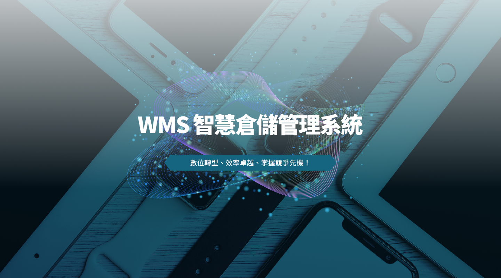

### 什麼是 WMS？

WMS（Warehouse Management System，倉儲管理系統）是一套專為現代企業設計的智慧倉儲解決方案，協助企業全面管理庫存、優化作業流程、提升作業透明度，從而降低成本並提升服務品質。

### WMS 系統的核心優勢

- 即時庫存掌握：動態追蹤庫存流動，精準掌握每一筆進出貨資訊，實現零庫存差異。
- 作業流程自動化：自動化收貨、分揀、補貨等流程，大幅提升倉儲作業效率。
- 彈性擴展整合：輕鬆與 ERP、電商平台、物流運輸系統無縫整合，滿足多元業務需求。
- 數據分析決策：即時生成報表，洞察營運關鍵數據，協助管理層快速做出精準判斷。
- 可整合 AGV 、 定位系統（UWB）、智慧料架，有效提升效率，降低人工作業錯誤，提升客戶滿意度。

### 為什麼選擇我們的 WMS 解決方案？

- 整合定位系統及智慧料架，提升庫存準確度，WMS 可即時追蹤庫存動態，減少人工盤點錯誤，讓企業隨時掌握庫存現況，降低庫存積壓與缺貨風險。
- 整合 AGV 優化作業效率，自動化流程如入庫、出庫、補貨、盤點等，有效縮短作業時間，減少人力需求，提高整體作業效率。
- 降低營運成本，透過精準的庫存管理和流程優化，減少不必要的庫存與搬運，降低倉儲空間與人員成本，提升資源利用率。
- 強化客戶服務，準確且快速的訂單處理，縮短出貨時間，提高訂單履約率，增強客戶滿意度與忠誠度。
- 減少人為錯誤，通過條碼等自動識別技術，降低人工操作失誤，確保貨品準確出入庫。

### 立即行動，搶佔智慧製造先機！

現在就聯繫我們，預約免費諮詢，由專業顧問為您規劃專屬 WMS 解決方案，助您的企業實現智慧生產、效率翻倍、營運升級！

掌握數位時代脈動，讓 WMS 系統成為您邁向智慧製造的最佳夥伴。

聯繫電話：0912083643  張先生

E-mail：Simon.chang@ewill.com.tw
