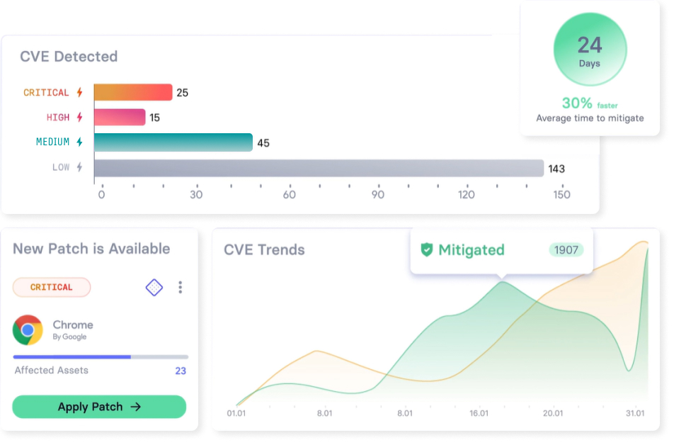

## Vicarius vRX

#### 漏洞風險管理

### Vicarius vRx 三大核心技術總覽－從漏洞發現、修補到自動化管理，全面提升資安效率

全自動資產掃描：偵測系統、應用與未知二進位程式漏洞。
CVE 情資整合：串接 NVD、CVSS、網路態勢，提供即時風險評估。
xTags™ 風險排序：AI 動態評估風險，優先處理高危漏洞。

### 修補與補救機制

智能補丁管理：自動推送補丁，確保設備安全更新。
無補丁防禦（Patchless Protection）：透過記憶體與 API 保護，防禦無法修補的漏洞。
補丁測試與快照回溯：RollBack & Snapshot 功能，避免修補錯誤影響營運。

### 自動化漏洞管理

AI 修補建議：減少人工，快速制定最適補救行動。
修補排程自動化：可預設補丁佈署或風險處置流程。
整合 IT 系統：支援串接 SIEM、SOAR、API 與通知系統，即時觸發資安事件報告。

